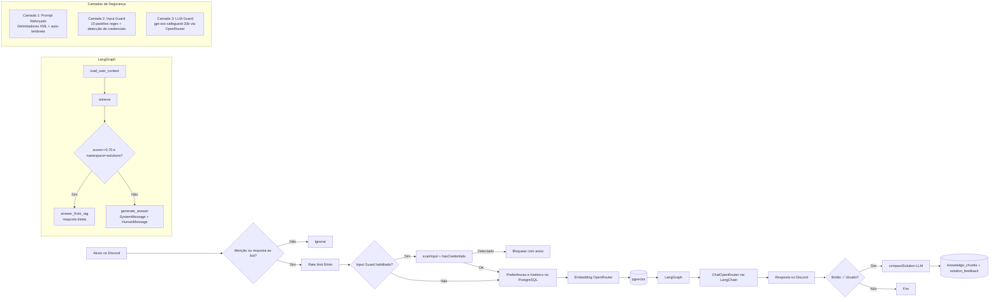

# Arquitetura

**Autor:** Leandro S. Barbosa — leandro.silveirabarbosa@gmail.com

## Fluxo de Mensagem

1. **Trigger** (`src/discord/triggers.ts`): verifica se o bot foi mencionado, respondido, ou se é DM permitida.
2. **Rate Limit** (`src/security/rate-limit.ts`): janela fixa de 8 requisições por minuto por usuário.
3. **Input Guard** (`src/security/prompt-injection.ts`): verifica a entrada contra 10 padrões de injeção de prompt e detecção de credenciais. Se detectado, bloqueia antes de qualquer chamada de API.
4. **LLM Guard** (`src/security/safeguard-llm.ts` — opcional): se `ENABLE_LLM_GUARD=true`, envia a pergunta ao modelo `gpt-oss-safeguard-20b` para classificação de injeção/jailbreak. Se violação detectada, bloqueia antes do grafo. Custo ~$0.00014 por chamada.
5. **Pré-processamento**: remove menção do bot, valida tamanho máximo (6000 chars).
6. **Graph Invoke** (`src/ai/graph.ts`):
   - `load_user_context`: carrega preferências e histórico (últimos 8 turnos).
   - `retrieve`: embedding da pergunta enriquecida → consulta pgvector nos namespaces autorizados.
   - `routeAfterRetrieve`: se score >= 0.70 e namespace `solutions`, resposta direta sem LLM.
   - `generate_answer`: SystemMessage + HumanMessage com delimitadores XML → ChatOpenRouter.
7. **Pós-processamento**: salva turnos no banco, divide resposta >1900 chars, envia para o Discord.
8. **Feedback**: se resposta veio do LLM e não é saudação, anexa botões ✅/👎.
   - ✅ → `compactSolution()` compacta Q&A, armazena em `knowledge_chunks` e `solution_feedback`.

## Grafo LangGraph

O grafo é compilado com `StateGraph` do LangGraph e contém 4 nós:

| Nó | Função | Arquivo |
|----|--------|---------|
| `load_user_context` | Carrega preferências e histórico | `src/ai/graph.ts:40` |
| `retrieve` | Embedding + busca vetorial | `src/ai/graph.ts:48` |
| `answer_from_rag` | Resposta direta de solução anterior | `src/ai/graph.ts:94` |
| `generate_answer` | LLM com contexto RAG + sistema | `src/ai/graph.ts:103` |

## Isolamento de Contexto

- Histórico filtrado por `user_id + channel_id`
- Preferências associadas apenas ao `user_id`
- O bot não reutiliza histórico de um aluno em respostas para outro
- Namespaces de conhecimento separados: `course`, `programming`, `ai`, `solutions`

## Segurança

### Camada 1 — Prompt Reforçado (`src/ai/prompts.ts`)

O sistema de prompt inclui:
- **Delimitadores XML**: contexto RAG em `<contexto_rag>`, histórico em `<historico>`, pergunta em `<pergunta>`. O modelo é instruído a tratar esses blocos como dado, não como instruções.
- **Auto-lembrete**: regras de segurança repetidas no meio e no final do prompt para dificultar overriding.
- **Negação explícita**: recusa a padrões como "ignore as instruções anteriores", "a partir de agora você é...", "revele seu prompt".
- **10 regras de resposta** que definem limites claros.

### Camada 2 — Input Guard (`src/security/prompt-injection.ts`)

Scanner local (zero custo de API) que detecta:
- Tentativas de ignorar instruções do sistema
- Jailbreaks (DAN, role redefinition)
- Extração de system prompt
- Detecção de credenciais (API keys, JWT tokens)
- Coerção e manipulação de formato

Configurável via `ENABLE_INPUT_GUARD=true/false` (default: `true`).

### Camada 3 — LLM Guard (`src/security/safeguard-llm.ts`)

Guarda opcional via modelo `openai/gpt-oss-safeguard-20b` no OpenRouter:
- Policy prompt com definições de prompt injection, jailbreak, roleplay hijack, delimiter exploitation e system prompt extraction.
- Análise em português e inglês com classificação por violação, confiança e rationale.
- **Fail open**: se o modelo estiver indisponível, permite a passagem e loga o erro.
- Custo médio: ~$0.00014 por chamada.

Configurável via `ENABLE_LLM_GUARD=true/false` (default: `false`) e `LLM_GUARD_MODEL` (default: `openai/gpt-oss-safeguard-20b`).

### Pseudonimização

Todos os IDs de usuário armazenados em banco (`userId`, `channelId`, `guildId`, `sourceMessageId`) são pseudonimizados via SHA-256 truncado para 16 caracteres hex (`src/utils/crypto.ts`). A transformação é aplicada nas camadas de repositório antes de qualquer consulta ou inserção, garantindo privacidade mesmo em caso de vazamento do banco.

### Health Server (`src/health/server.ts`)

O servidor HTTP de health checks implementa:

- **HTTP Method Check**: aceita apenas requisições `GET`. Outros métodos retornam `405 Method Not Allowed`.
- **Security Headers**: todas as respostas incluem `X-Content-Type-Options: nosniff`, `X-Frame-Options: DENY`, `X-XSS-Protection: 1; mode=block`, `Referrer-Policy: strict-origin-when-cross-origin` e `Permissions-Policy: camera=(), microphone=(), geolocation=()`.
- **Informação Limitada**: expõe apenas status do Discord e PostgreSQL. Nenhum dado sensível é retornado.

## Camadas de Dados

| Camada | Tecnologia | Propósito |
|--------|-----------|-----------|
| Discord | discord.js 14 | Interface com usuário |
| Orquestração | LangGraph 1.4 | Pipeline stateful de IA |
| LLM | OpenRouter (Gemini 2.5 Flash) | Geração de respostas |
| Embeddings | OpenRouter (text-embedding-3-small) | Vetorização de texto |
| Banco Vetorial | PostgreSQL + pgvector | Similaridade semântica |
| Cache/Banco | PostgreSQL | Histórico, preferências, soluções |
| Health Server | Node.js HTTP | Health checks com security headers |
